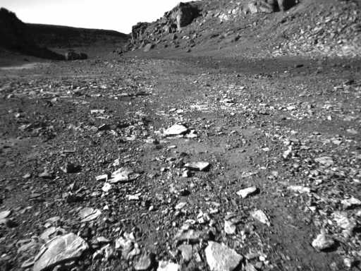
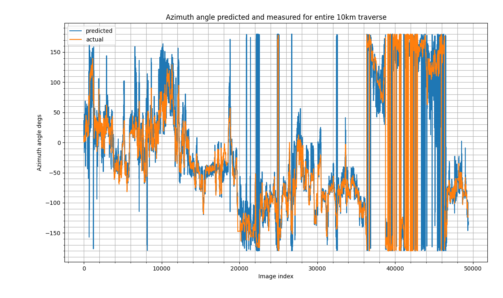

# The regression task

Given an image like this:

The network has to learn to regress a target which is a unit vector in the direction of the sun, relative to the camera.

# Devon island dataset
We are using the Devon Island dataset, a 10Km traverse across a martian analogue surface. See here for more details: [http://asrl.utias.utoronto.ca/datasets/devon-island-rover-navigation/rover-traverse.html]

# The results
We train a network to regress the sun direction from the image. 

Here is a comparison of the `1_100_100_baseline2` network applied to the whole traverse vs the onboard sun sensor:

Overall it gives pretty good results, but we are also testing on the same dataset we trained on, so it's not a fair comparison. Next steps will be to identify other datasets to train and test on.
